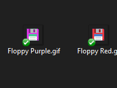

# Aseprite-Edit-Context-Menu
A simple registry snippet, adds an "Edit with Aseprite" option to your right-click menu on Windows. This makes it a bit easier to open GIFs, PNGs, and BMPs with Aseprite on Windows, without having to permanently change the default program for those files.

## Do take note: Selecting multiple files and clicking this option will launch multiple instances of Aseprite.exe! I'm not sure if there is an easy way to send all files to "one window" and open them inside Aseprite as tabs. That would likely require some programming from the develpers to solve, as Windows doesn't support this feature natively.

If you appreciate this little add-on, feel free to drop me a tip: https://ko-fi.com/jamesorthii

Or check out some of my other work. I make art, animations, and small productivity apps:
- https://jameso2.itch.io/
- https://youtu.be/NSzUt5DZ2tk
- https://jamesorthii.wixsite.com/portfolio
- https://twitter.com/JamesOrthII
